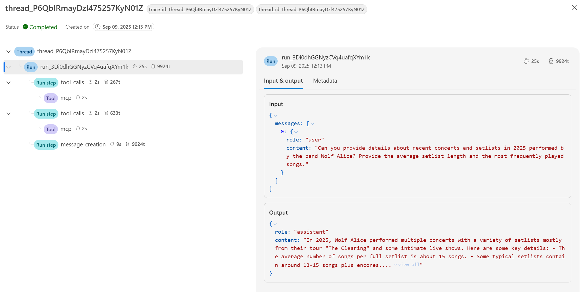

# mcp-azure-apim

This project demonstrates how to use Azure API Management (APIM) to expose an existing REST API as a Model-Context-Protocol (MCP) Server. The MCP Server can then be consumed as a tool by various clients, including AI agents built with Azure AI services.

[Setlist.fm](https://www.setlist.fm/) is a collaborative online platform dedicated to documenting setlists—the lists of songs performed by artists or bands during concerts. Unlike official setlists, Setlist.fm focuses on what was actually played at live events.

The project uses the public [Setlist.fm API](https://api.setlist.fm/docs/1.0/index.html) as an example. It provisions the necessary Azure infrastructure using Bicep and the Azure Developer CLI (`azd`).

## Documentation

- https://learn.microsoft.com/en-us/azure/api-management/mcp-server-overview
- https://devblogs.microsoft.com/foundry/announcing-model-context-protocol-support-preview-in-azure-ai-foundry-agent-service/
- https://devblogs.microsoft.com/blog/connect-once-integrate-anywhere-with-mcps

## Configuration

[](https://vscode.dev/redirect?url=vscode://ms-vscode-remote.remote-containers/cloneInVolume?url=https://github.com/bmoussaud/mcp-azure-apim)

### Configure Azure Resources

This project is using `azd` to configure the Azure Resources

```bash
azd up

New environment 'dev' created and set as default
? Select an Azure Subscription to use: 25. xxxxx-qqqqqqq-xxxxx (111111111-1111-1111-1111-11111111)
? Pick a resource group to use: 1. Create a new resource group
? Select a location to create the resource group in: 50. (US) East US 2 (eastus2)
? Enter a name for the new resource group: rm-mcp-dev
```

This project is configured using Azure Bicep, which defines the following resources:

1. **API Management** Manages APIs for the application, providing a gateway for API calls, used to MCP Feature to expose API
2. **Application Insights** Monitors application performance and usage, providing insights into the application's health.
3. **Log Analytics Workspace** Collects and analyzes log data from various resources for monitoring and troubleshooting.
4. **AI Foundry** Deploys AI models, specifically a GPT-4.1 mini model for inference
5. **SetlistFM API** Provides access to the SetlistFM API, allowing users to retrieve setlist data using APIM
6. **Named Value for API Key** Stores the API key securely for accessing the SetlistFM API.
7. **Application Registration** in EntraID to manage OAuth2 Permission Scopes.

### Exposed API using an MCP Server

Go the Azure Portal https://portal.azure.com, select the APIM instance and MCP Servers (preview)
Create a MCP Server, expose API as an MCP Server

- API: `SetList FM`
- API Operations: `Search for Artists, Search for Setlists`
- Display Name: `MCP Setlist FM`
- Name: `mcp-setlist-fm`

The MCP Server is ready.


### Test SetList FM API

```bash
cd src/shell
# the script displays the latest setlist performed by The Weeknd
./test_api.sh
```

## Test MCP Server

Prepare the environment:

```bash
cd src/python
uv venv --clear
source .venv/bin/activate
azd env get-values > .env
uv sync
```

### Using MCP Client (Python)

`mcp_client.py` uses a library acting as MCP Client. It lists the exposed tools, and call them: `searchForArtists(coldplay)` and `searchForSetlists(Blondshell)`

```bash
uv run mcp_client.py
```

Sample Output

```
🔗 Testing connection to https://mcp-azure-apim-api-management-dev.azure-api.net/setlistfm-mcp/mcp...
✅ Successfully authenticated!
🔧 Available tools (2):
   - searchForArtists
     Input Schema: {'type': 'object', 'properties': {'artistName': {'type': 'string', 'description': "the artist's name"}, 'p': {'type': 'string', 'description': "the number of the result page you'd like to have"}}, 'required': ['artistName', 'p'], 'additionalProperties': False}
   - searchForSetlists
     Input Schema: {'type': 'object', 'properties': {'year': {'type': 'string', 'description': 'the year of the event'}, 'artistName': {'type': 'string', 'description': "the artist's name"}, 'p': {'type': 'string', 'description': 'the number of the result page'}, 'artistMbid': {'type': 'string', 'description': "the artist's Musicbrainz Identifier (mbid)"}}, 'required': ['artistMbid', 'artistName', 'p', 'year'], 'additionalProperties': False}
------------------------------------------------------------------------------------------------------------------------------
🔗 Search for artists with 'Coldplay' in the name
| Name                                 | URL                                                                               |
| ------------------------------------ | --------------------------------------------------------------------------------- |
| Buena Vista Social Club vs. Coldplay | https://www.setlist.fm/setlists/buena-vista-social-club-vs-coldplay-5bd5f7a4.html |
| Michael Calfan & Coldplay            | https://www.setlist.fm/setlists/michael-calfan-and-coldplay-6bdf329e.html         |
| Cat Power & Coldplay                 | https://www.setlist.fm/setlists/cat-power-and-coldplay-6bd87e1a.html              |
| The Chainsmokers & Coldplay          | https://www.setlist.fm/setlists/the-chainsmokers-and-coldplay-33ce5029.html       |
| Coldplay                             | https://www.setlist.fm/setlists/coldplay-3d6bde3.html                             |
------------------------------------------------------------------------------------------------------------------------------
🔗 Get a list of setlists for Blondshell
🎤 23-09-2025 · History (Toronto)
Tour: The Clearing
Link: https://www.setlist.fm/setlist/wolf-alice/2025/history-toronto-on-canada-2b47f072.html

Set:
  1. Thorns
  2. Your Loves Whore
  3. Formidable Cool
  4. Passenger Seat
  5. Bloom Baby Bloom
  6. Just Two Girls
  7. Leaning Against the Wall
  8. How Can I Make It OK?
  9. Safe From Heartbreak (If You Never Fall in Love)
  10. White Horses
  11. Bros
  12. Delicious Things
  13. Bread Butter Tea Sugar
  14. Yuk Foo
  15. Play the Greatest Hits
  16. Silk
  17. Play It Out
  18. Smile
  19. Giant Peach
  20. The Sofa

Encore:
  1. Don't Delete the Kisses
👋 Closing client...
```

### Using Github Copilot

Github Copilot in the agent mode can include external tools defined in the `mcp.json` file. this file automatically generated by the `azd up` command. The generation can be manually triggered with the following command `azd hooks run preprovision`

<summary>Demo: MCP and Github Copilot Agent Mode</summary>
<video src="https://github.com/user-attachments/assets/fa736a42-af49-4124-8d43-7abde7525d77" width="600" autoplay loop muted>
   Your browser does not support the video tag.
</video>

### Using a Custom Agent (Azure Ai Foundry)

MCP has designed to provides tools to any agent. This is a sample where `azure_ai_agent_mcp.py` uses the [Azure Agent Service] library to create an [Agent in Azure AI Foundry] configured to use the `SetlistFM MCP Server` as tool.

```bash
uv run azure_ai_agent_mcp.py
```

Sample Output:

```
Setting up Setlist FM plugin https://mcp-azure-apim-api-management-dev.azure-api.net/setlistfm-mcp/mcp
MCP Tool configured with HEADERs: {'Ocp-Apim-Subscription-Key': 'b5a0cd59c5d84ea7bf80611ddc6ebd71'}
MCP Tool resources: {'mcp': [{'server_label': 'setlisftfm', 'headers': {'Ocp-Apim-Subscription-Key': 'b5a0cd59c5d84ea7bf80611ddc6ebd71'}, 'require_approval': 'always'}]}
Created agent, ID: asst_N5OIDYE56NQp6JrIEFKuQHPN
MCP Server: setlisftfm at https://mcp-azure-apim-api-management-dev.azure-api.net/setlistfm-mcp/mcp
Created thread, ID: thread_P6QbIRmayDzl475257KyN01Z
Posting task to agent: Can you provide details about recent concerts and setlists in 2025 performed by the band Wolf Alice? Provide the average setlist length and the most frequently played songs.
Created message, ID: msg_EGr8udkkxcXEohofJkA4wzb7
Created run, ID: run_3Di0dhGGNyzCVq4uafqXYm1k
Current run status: RunStatus.IN_PROGRESS
Approving tool call: mcp/setlisftfm/searchForArtists
 with inputs: {"artistName":"Wolf Alice","p":"1"}
Current run status: RunStatus.REQUIRES_ACTION
Current run status: RunStatus.IN_PROGRESS
Current run status: RunStatus.IN_PROGRESS
Current run status: RunStatus.IN_PROGRESS
Current run status: RunStatus.IN_PROGRESS
Approving tool call: mcp/setlisftfm/searchForSetlists
 with inputs: {"year":"2025","artistName":"Wolf Alice","p":"1","artistMbid":"3547f34a-db02-4ab7-b4a0-380e1ef951a9"}
Current run status: RunStatus.REQUIRES_ACTION
Current run status: RunStatus.IN_PROGRESS
Current run status: RunStatus.IN_PROGRESS
Current run status: RunStatus.IN_PROGRESS
Current run status: RunStatus.IN_PROGRESS
Current run status: RunStatus.IN_PROGRESS
Current run status: RunStatus.IN_PROGRESS
Current run status: RunStatus.IN_PROGRESS
Current run status: RunStatus.IN_PROGRESS
Current run status: RunStatus.IN_PROGRESS
Current run status: RunStatus.IN_PROGRESS
Current run status: RunStatus.IN_PROGRESS
Current run status: RunStatus.COMPLETED
Run completed with status: RunStatus.COMPLETED
Step step_NmSFDvYVsCfLmWQf7g7sxyvO status: completed

Step step_16Z5uF6mtBH6EmP7rAGP9j6M status: completed
 Tool Call ID: call_HnHm4qXiLXbFzvGxoGwgvkyF
 Type: mcp/setlisftfm/searchForSetlists
 inputs: {"year":"2025","artistName":"Wolf Alice","p":"1","artistMbid":"3547f34a-db02-4ab7-b4a0-380e1ef951a9"}

Step step_KYw0M9Jm5j7xKyKwonyN3xpO status: completed
 Tool Call ID: call_kJYPeExQqL5jBzm78BYBzV86
 Type: mcp/setlisftfm/searchForArtists
 inputs: {"artistName":"Wolf Alice","p":"1"}


Conversation:
--------------------------------------------------
USER: Can you provide details about recent concerts and setlists in 2025 performed by the band Wolf Alice? Provide the average setlist length and the most frequently played songs.
--------------------------------------------------
ASSISTANT: In 2025, Wolf Alice performed multiple concerts with a variety of setlists mostly from their tour "The Clearing" and some intimate live shows. Here are some key details:

- The average number of songs per full setlist is about 15 songs.
- Some typical setlists contain around 13-15 songs plus encores.
- Most frequently played songs include:
  - "Formidable Cool"
  - "Smile"
  - "Delicious Things"
  - "Passenger Seat"
  - "Bloom Baby Bloom"
  - "Just Two Girls"
  - "Safe in the World"
  - "Bros"
  - "How Can I Make It OK?"
  - "Lisbon"
  - "White Horses"
  - "Thorns"
  - "Don't Delete the Kisses"
  - "The Sofa"
  - "Giant Peach"

- They often close encore segments with "The Sofa" and "Giant Peach," sometimes featuring the outro of "Seven Nation Army" and "Iron Man."

The overall concert length in terms of setlist size is consistent around the range of 13 to 16 songs, including encores.

You can view detailed setlists for each show on their setlist.fm page: https://www.setlist.fm/setlists/wolf-alice-bdcd1c2.html
```

### AI Foundry

once executed, it is possible to view the executed thread in the AI Foundry Portal http://ai.azure.com




### MCP Policies in APIM (EntraID)

As the MCP server has it own policy layer, there are several scenario that can be implemented.

- to set a rate limiting on the MCP side to protect the API part
- to manage inbound authentication, authorization (EntraID / OAuth2)
- to manage outbund authentication, authorization to the backend api (Headers)
- to update the request document or the response document

The steps to define the MCP policy are:

1. Open the azure portal and select the APIM instance
1. Select the left side `MCP Servers` and open the `mcp-setlist-fm` server
1. Open the policies menu

In this sample, an EntraID application has been defined to represent the the MCP Server. The client will perform an EntraId authentication process and the policy validates the provided token and then and header will be added to inject the `Ocp-Apim-Subscription-Key` value.

It is implementing this APIM Pattern: [API Authentication with API Management (APIM) using APIM Policies with Entra ID and App Roles](https://github.com/microsoft/apim-auth-entraid-with-approles/blob/main/README.md)

1. paste the following content [src/apim/setlistfm/mcp-policy-setlistfm-entra-id.xml](src/apim/setlistfm/mcp-policy-setlistfm-entra-id.xml)

```xml
   .....
   <inbound>
        <validate-jwt header-name="Authorization" failed-validation-httpcode="401" failed-validation-error-message="Unauthorized due Benoit APIM Policy" require-expiration-time="true" require-scheme="Bearer" require-signed-tokens="true">
            <openid-config url="https://login.microsoftonline.com/OAUTH_TENANT_ID/v2.0/.well-known/openid-configuration" />
            <audiences>
                <audience>api://OAUTH_APP_ID</audience>
            </audiences>
            <issuers>
                <issuer>https://sts.windows.net/OAUTH_TENANT_ID/</issuer>
            </issuers>
        </validate-jwt>
		<!-- Set the subscription key header for the backend service -->
		<set-header name="Ocp-Apim-Subscription-Key" exists-action="override">
			<value>SETLISTAPI_SUBSCRIPTION_KEY</value>
		</set-header>
		<base />
	</inbound>
   .....
```

If you run the previous python code, you'll get an `401` error

```bash
uv run mcp_client_rate.py
🔗 Testing connection to https://mcp-azure-apim-api-management-dev.azure-api.net/setlistfm-mcp/mcp...
❌ failure : Client error '401 Unauthorized' for url 'https://mcp-azure-apim-api-management-dev.azure-api.net/setlistfm-mcp/mcp'
For more information check: https://developer.mozilla.org/en-US/docs/Web/HTTP/Status/401
👋 Closing client...
```

Run the following test:

```bash
uv run mcp_client_entra_id.py  default_credential|client_secret|msal
```

what ever the option, the output should be the same when using simple basic authentication using Header.
The options are:

- `default_credential` uses use the magic `DefaultAzureCredential` that support several Azure Authentication features. It re-use the `az login` or the `azd auth login`
- `client_secret` uses the client_id, the client_secret and the tenant_id properties
- `client_secret` uses the client_id, the client_secret and the tenant_id properties and MSAL (Microsoft Authentication Library) library. It’s a client SDK family (for Python, .NET, Java, JavaScript, etc.) that hides the wire details of standard identity protocols. Under the hood, MSAL talks to Microsoft Entra ID (formerly Azure AD) using OAuth 2.0 and OpenID Connect endpoints.

## Clean up

```bash
azd down --force --purge
```

oauth/entraid

https://github.com/microsoft/apim-auth-entraid-with-approles/blob/main/README.md
https://github.com/swgriffith/azure-guides/blob/master/aad-oauth2-on-behalf-of.md
