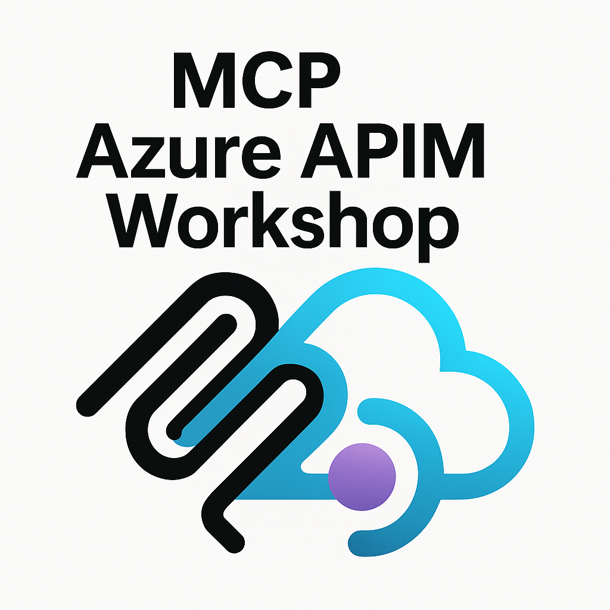
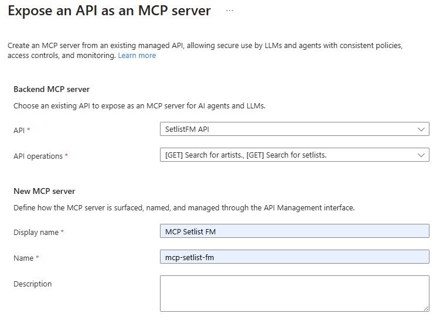
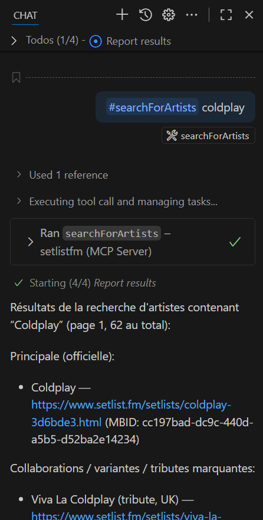
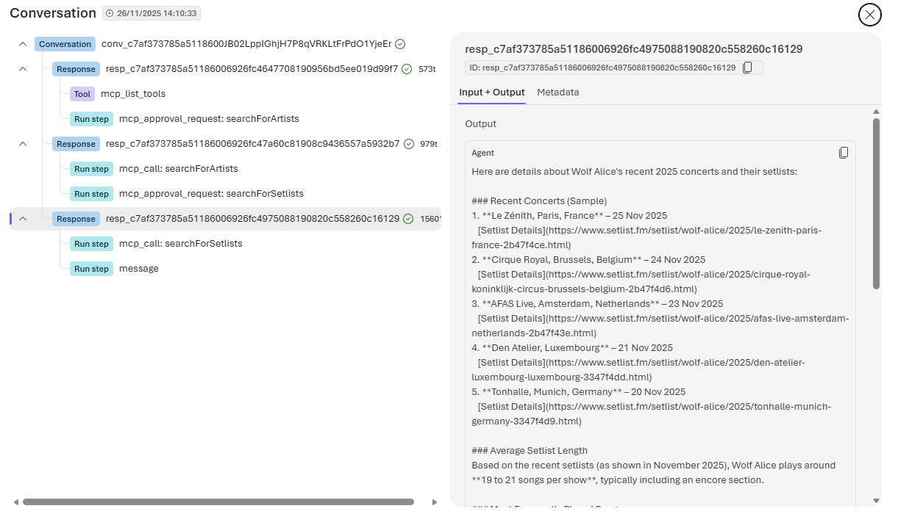
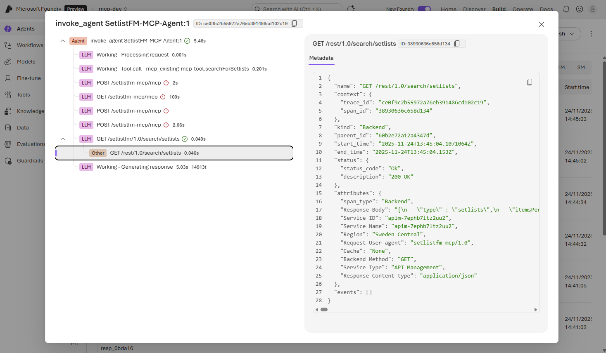
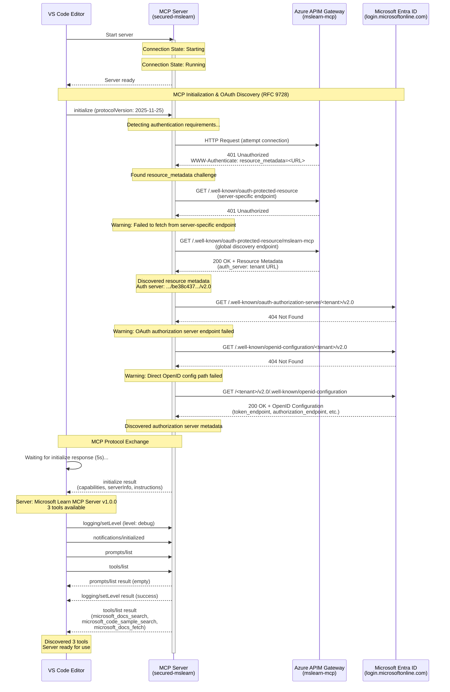

# MCP Azure APIM Workshop



## Table of Contents

- [Documentation](#documentation)
- [Workshop](#workshop)
  - [1. Configure Azure Resources](#1-configure-azure-resources)
  - [2. Expose API as an MCP Server](#2-expose-api-as-an-mcp-server)
  - [3. Setup Python environment](#3-setup-python-environment)
  - [4. Fastapi MCP Client (Python)](#4-fastapi-mcp-client-python)
  - [5. Github Copilot MCP Tool (vscode)](#5-github-copilot-mcp-tool-vscode)
  - [6. Custom Agent on Azure Ai Foundry (Python)](#6-custom-agent-on-azure-ai-foundry-python)
  - [7. MCP Policies in APIM (EntraID)](#7-mcp-policies-in-apim-entraid)
  - [8. Secure MCP MS Learn using EntraID and APIM](#8-secure-mcp-ms-learn-using-entraid-and-apim)
  - [9. MCP Registry for GitHub Copilot and VSCode](#9-mcp-registry-for-github-copilot-and-vscode)


This workshop demonstrates how to use Azure API Management (APIM) to expose an existing REST API as a Model-Context-Protocol (MCP) Server. The MCP Server can then be consumed as a tool by various clients, including AI agents built with Azure AI services.

What you will learn in this workshop:

- deploy an Azure infrastructure with [Azure Developer CLI](https://learn.microsoft.com/en-us/azure/developer/azure-developer-cli/overview) (`azd`)
- expose a rest API on a MCP Server on an APIM
- call the MCP Server from different clients:
  - a python script using the [fastmcp](https://pypi.org/project/fastmcp/) library
  - a python script using the [azure-ai-agents](https://pypi.org/project/azure-ai-agents/) library
- call the MCP Server through a [GitHub Copilot MCP tool](https://docs.github.com/en/copilot/how-tos/provide-context/use-mcp/extend-copilot-chat-with-mcp?tool=vscode)
- add a security layer on the MCP Server through APIM policies

The workshop leverages the public [Setlist.fm API](https://api.setlist.fm/docs/1.0/index.html) as an example. It provisions the necessary Azure infrastructure using Bicep and the Azure Developer CLI (`azd`).
[Setlist.fm](https://www.setlist.fm/) is a collaborative online platform dedicated to documenting setlists—the lists of songs performed by artists or bands during concerts. Unlike official setlists, Setlist.fm focuses on what was actually played at live events.

## Documentation

- https://learn.microsoft.com/en-us/azure/api-management/mcp-server-overview
- https://devblogs.microsoft.com/foundry/announcing-model-context-protocol-support-preview-in-azure-ai-foundry-agent-service/
- https://devblogs.microsoft.com/blog/connect-once-integrate-anywhere-with-mcps

## Workshop

[](https://vscode.dev/redirect?url=vscode://ms-vscode-remote.remote-containers/cloneInVolume?url=https://github.com/bmoussaud/mcp-azure-apim)

### 1. Configure Azure Resources

This project is using `azd` to configure the Azure Resources

```bash
azd auth login
azd up
```

You will be prompted for where to deploy the infrastructure:

```bash
New environment 'dev' created and set as default
? Select an Azure Subscription to use: 25. xxxxx-qqqqqqq-xxxxx (111111111-1111-1111-1111-11111111)
? Pick a resource group to use: 1. Create a new resource group
? Select a location to create the resource group in: 50. (US) East US 2 (eastus2)
? Enter a name for the new resource group: rm-mcp-dev
```

This repository is configured using Azure Bicep, which defines the following resources:

1. **API Management** manages APIs for the application, providing a gateway for API calls, used to MCP Feature to expose API
2. **Application Insights** monitors application performance and usage, providing insights into the application's health.
3. **Log Analytics Workspace** collects and analyzes log data from various resources for monitoring and troubleshooting.
4. **AI Foundry** deploys AI models, specifically a GPT-4.1 mini model for inference.
5. **SetlistFM API** provides access to the SetlistFM API, allowing users to retrieve setlist data using APIM.
6. **Named Value for API Key** stores the API key securely for accessing the SetlistFM API.
7. **Application Registration** in EntraID to manage OAuth2 Permission Scopes.
8. **API Center** manages the MCP Registry. Once provisioned, goto the Azure portal to enable the APIC Center Portal. 

*Note* the *API Center* is not configured by default, to enable it edit `infra/main.parameters.json` and set `configureAPICenter` with the value `True`


### 2. Expose API as an MCP Server

Go the Azure Portal https://portal.azure.com, select the APIM instance and MCP Servers (preview)
Create a MCP Server, expose API as an MCP Server

- API: `SetList FM`
- API Operations: `Search for Artists, Search for Setlists`
- Display Name: `SetlistFM MCP`
- Name: `setlistfm-mcp`
  Note: this value must match the value in .vscode/mcp.json and src/python/.env



Test SetList FM API:

```bash
# the script displays the latest setlist performed by The Weeknd
./src/shell/test_api.sh
```

The MCP Server is ready!

*Note*  to enable this configuration managed by the bicep file, edit `infra/main.parameters.json` and set `configureSetListfmMCP` with the value `True`

### 3. Setup Python environment

```bash
cd src/python
uv venv --clear
source .venv/bin/activate
uv sync
```

### 4. Fastapi MCP Client (Python)

`mcp_client.py` uses a library acting as MCP Client. It lists the exposed tools, and call them: `searchForArtists(coldplay)` and `searchForSetlists(Blondshell)`

```bash
uv run mcp_client.py
```

Sample Output


> 🔗 Testing connection to https://mcp-azure-apim-api-management-dev.azure-api.net/setlistfm-mcp/mcp...  
> ✅ Successfully authenticated!  
> 🔧 Available tools (2):  
> [...]  
> 🔗 Search for artists with 'Coldplay' in the name  
> | Name                                 | URL                                                                               |
> | ------------------------------------ | --------------------------------------------------------------------------------- |
> [...]  
> ------------------------------------------------------------------------------------------------------------------------------
> 🔗 Get a list of setlists for Blondshell  
> 🎤 23-09-2025 · History (Toronto)  
> Tour: The Clearing  
> Link: https://www.setlist.fm/setlist/wolf-alice/2025/history-toronto-on-canada-2b47f072.html  
> [...]  
> 👋 Closing client...  


### 5. Github Copilot MCP Tool (vscode)

Github Copilot in the [Agent Mode](https://code.visualstudio.com/blogs/2025/02/24/introducing-copilot-agent-mode) can include external tools defined in the `mcp.json` file.

In this workshop, this file was automatically generated by the `azd up` command. You can review the content of the file in [mcp.json](./.vscode/mcp.json).

Note: The generation can be manually triggered with the following command `azd hooks run preprovision`

To call the MCP tool from copilot, type the following text in the copilot chat:

```bash
#searchForArtists coldplay
```

Copilot should request you to validate the usage of the MCP tool:




#### Demo: MCP and Github Copilot Agent Mode
<video src="https://github.com/user-attachments/assets/fa736a42-af49-4124-8d43-7abde7525d77" width="600" autoplay loop muted>
   Your browser does not support the video tag.
</video>


### 6. Custom Agent on Azure Ai Foundry (Python)

MCP is designed to provides tools to any agent. This is a sample where `azure_ai_agent_mcp.py` uses the [Azure Agent Service](https://learn.microsoft.com/en-us/python/api/overview/azure/ai-agents-readme?view=azure-python) library to create an **Agent in Azure AI Foundry** configured to use the `SetlistFM MCP Server` as tool.

```bash
uv run azure_ai_agent_mcp.py
```

Sample Output:

```
Setting up AI Project Client
PROJECT_ENDPOINT: https://foundry-7ephb7ltz2uu2.services.ai.azure.com/api/projects/mcp-dev
Setting up Setlist FM plugin https://apim-7ephb7ltz2uu2.azure-api.net/setlistfm-mcp/mcp
Created agent: SetlistFM-MCP-Agent
Agent ID: SetlistFM-MCP-Agent:1
Agent created (id: SetlistFM-MCP-Agent:1, name: SetlistFM-MCP-Agent, version: 1)
Sending request to agent...
TASK: Can you provide details about recent concerts and setlists in 2025 performed by the band Wolf Alice? Provide the average setlist length and the most frequently played songs.
Response Item Type: mcp_list_tools
Response Item Type: mcp_approval_request
Approving MCP request for server: existing-mcp-tool, request ID: mcpr_0827a8c84ce4fb44006924615f281081949e5f81c37fd308cc
Approving the call of 'searchForSetlists' with the following arguments: {"year":"2025","artistName":"Wolf Alice","p":"1"}
Processed 1 MCP approval requests.
Response Item Type: mcp_call
Response Item Type: message
No MCP approval requests to process.
STOP:  [McpCall(id='mcp_0827a8c84ce4fb44006924615ff9488194a6b2146b967fbab1', arguments='{"year":"2025","artistName":"Wolf Alice","p":"1"}', name='searchForSetlists', ......
Response Item Type: mcp_call
Response Item Content: {
   "type" : "setlists",

```

Once the conversation is finished, it is possible to view the executed thread in the [AI Foundry Portal](http://ai.azure.com):





### 7. MCP Policies in APIM (EntraID)

As the MCP server has it own policy layer, there are several scenario that can be implemented.

- to set a rate limiting on the MCP side to protect the API part
- to manage inbound authentication, authorization (EntraID / OAuth2)
- to manage outbund authentication, authorization to the backend api (Headers)
- to update the request document or the response document

The steps to define the MCP policy are:

1. Open the azure portal and select the APIM instance
1. Select the left side `MCP Servers` and open the `mcp-setlist-fm` server
1. Open the policies menu

In this sample, an EntraID application has been defined to represent the the MCP Server. The client will perform an EntraId authentication process and the policy validates the provided token and then and header will be added to inject the `Ocp-Apim-Subscription-Key` value.

It is implementing this APIM Pattern: [API Authentication with API Management (APIM) using APIM Policies with Entra ID and App Roles](https://github.com/microsoft/apim-auth-entraid-with-approles/blob/main/README.md)

Doc: [Secure access to MCP servers in API Management / Token-based authentication (OAuth 2.1 with Microsoft Entra ID)](https://learn.microsoft.com/en-us/azure/api-management/secure-mcp-servers#token-based-authentication-oauth-21-with-microsoft-entra-id)

1. paste the following content [src/apim/setlistfm/mcp-policy-setlistfm-entra-id.xml](src/apim/setlistfm/mcp-policy-setlistfm-entra-id.xml) (File generated during the execution of the `azd up` command, you can run the generation again using the `azd hooks run postprovision` command)

```xml
   .....
   <inbound>
        <validate-jwt header-name="Authorization" failed-validation-httpcode="401" failed-validation-error-message="Unauthorized due Benoit APIM Policy" require-expiration-time="true" require-scheme="Bearer" require-signed-tokens="true">
            <openid-config url="https://login.microsoftonline.com/OAUTH_TENANT_ID/v2.0/.well-known/openid-configuration" />
            <audiences>
                <audience>api://OAUTH_APP_ID</audience>
            </audiences>
            <issuers>
                <issuer>https://sts.windows.net/OAUTH_TENANT_ID/</issuer>
            </issuers>
        </validate-jwt>
		<!-- Set the subscription key header for the backend service -->
		<set-header name="Ocp-Apim-Subscription-Key" exists-action="override">
			<value>SETLISTAPI_SUBSCRIPTION_KEY</value>
		</set-header>
		<base />
	</inbound>
   .....
```

If you run the previous python code, you'll get an `401` error:

```bash
uv run mcp_client.py
```

> 🔗 Testing connection to https://mcp-azure-apim-api-management-dev.azure-api.net/setlistfm-mcp/mcp...  
> ❌ failure : Client error '401 Unauthorized' for url 'https://mcp-azure-apim-api-management-dev.azure-api.net/setlistfm-mcp/mcp'  
> For more information check: https://developer.mozilla.org/en-US/docs/Web/HTTP/Status/401  
> 👋 Closing client...

Run the following test:

```bash
uv run mcp_client_entra_id.py  default_credential|client_secret|msal
```

what ever the option, the output should be the same when using simple basic authentication using Header.
The options are:

- `default_credential` uses use the magic `DefaultAzureCredential` that support several Azure Authentication features. It re-use the `az login` or the `azd auth login`
- `client_secret` uses the client_id, the client_secret and the tenant_id properties
- `client_secret` uses the client_id, the client_secret and the tenant_id properties and MSAL (Microsoft Authentication Library) library. It’s a client SDK family (for Python, .NET, Java, JavaScript, etc.) that hides the wire details of standard identity protocols. Under the hood, MSAL talks to Microsoft Entra ID (formerly Azure AD) using OAuth 2.0 and OpenID Connect endpoints.


### 8. Secure MCP MS Learn using EntraID and APIM

The Microsoft [Learn MCP Server](https://learn.microsoft.com/en-us/training/support/mcp) enables clients like GitHub Copilot and other AI agents to bring trusted and up-to-date information directly from Microsoft's official documentation. It is a remote MCP server that uses streamable http. It allows to search through documentation, fetch a complete article, and search through code samples. The aim of this sample is to proxy the MCP Server and to secure its access.

This configuration has been tested using GitHub Copilot. The execution of `azd provision` command configures Azure APIM & Azure EntraID and update the [mcp.json](.vscode/mcp.json) file.

On the EntraID side, an Entra ID (Azure AD) application registration provides the OAuth2/OIDC authentication for the Microsoft Learn MCP proxy.
On the APIM side, Deployment of an MCP (Model Context Protocol) proxy API in Azure API Management that serves as a gateway to the Microsoft Learn documentation and code sample APIs.

Two Bicep Modules manages this configuration:
the module mslearn [mcp-proxy.bicep](infra/modules/mcp-proxy.bicep)
* Creates an MCP-type API in APIM with streamable transport
* Configures a backend pointing to https://learn.microsoft.com/api/mcp
* Applies custom policy configurations loaded from src/apim/mslearn/mcp-policy-mslearn.xml
* Implements Protected Resource Metadata (PRM) endpoints per RFC 9728:
  *  server-specific PRM endpoint at /.well-known/oauth-protected-resource within the MCP API
  * A global dynamic discovery endpoint for MCP resource metadata
* Configures OAuth2 authentication settings for the MCP proxy

the module mcpMSLearnApp [app-reg.bicep](infra/modules/app-reg.bicep)
* Application Name: mcp-proxy-mslearn (with resource token suffix)
* Permission Scope: Exposes a user_impersonate OAuth2 permission scope
* Pre-authorized Application: VS Code (aebc6443-996d-45c2-90f0-388ff96faa56) is pre-authorized to access this scope without requiring user consent

Authentication Flow:
This app registration enables:

* Client applications (like VS Code) to authenticate users via OAuth2
* Users to delegate access to Microsoft Learn resources through the MCP proxy
* APIM policies to validate bearer tokens against this Entra ID application


Based on the traces, here's a Mermaid sequence diagram showing the MCP server initialization flow with OAuth2 discovery:

This diagram illustrates:

1. Lifecycle: Start sequence
1. OAuth2/OIDC Discovery (RFC 9728): The authentication discovery flow with multiple fallback attempts
1. Resource Metadata Discovery: Finding the APIM protected resource metadata
1. Authorization Server Discovery: Locating the Entra ID OpenID configuration
1. MCP Protocol Handshake: Initialize request/response and capability exchange
1. Tool Discovery: Listing available MCP tools (3 Microsoft Learn documentation tools)
1. The key security pattern shown is the Protected Resource Metadata (PRM) discovery mechanism where the MCP client automatically discovers OAuth2 endpoints by following WWW-Authenticate challenges and well-known discovery URLs.



## 9. MCP Registry for GitHub Copilot and VSCode.

Reference: [Locking Down MCP: Create a Private Registry on Azure API Center and Enforce It in GitHub Copilot And VS Code ](https://devblogs.microsoft.com/all-things-azure/locking-down-mcp-create-a-private-registry-on-azure-api-center-and-enforce-it-in-github-copilot-and-vs-code) and https://docs.github.com/en/copilot/how-tos/administer-copilot/manage-mcp-usage/configure-mcp-registry#option-2-using-azure-api-center-as-an-mcp-registry

```bash
API_CENTER_RUNTIME_ENDPOINT=$(azd env get-value API_CENTER_RUNTIME_ENDPOINT)
echo "MCP Registry: ${API_CENTER_RUNTIME_ENDPOINT}/workspaces/default/v0.1/servers"
curl  ${API_CENTER_RUNTIME_ENDPOINT}/workspaces/default/v0.1/servers | jq
```
```
MCP Registry: https://mcp-demo-iq6gqqdm2wnp6.data.swedencentral.azure-apicenter.ms/workspaces/default/v0.1/servers
{
  "servers": [
    {
      "server": {
        "$schema": "https://static.modelcontextprotocol.io/schemas/2025-09-29/server.schema.json",
        "name": "2049090721144127476",
        "description": "Setlist.fm MCP for concert details",
        "version": "Original",
        "remotes": [
          {
            "type": "sse",
            "url": "apim-iq6gqqdm2wnp6.azure-api.net/setlistfm-mcp"
          }
        ]
      },
      "_meta": {
        "io.modelcontextprotocol.registry/official": {
          "status": "active",
          "createdAt": "2025-12-05T10:48:11.8074044+00:00",
          "updatedAt": "2025-12-05T10:48:15.2662824+00:00",
          "isLatest": true
        },
        "x-ms-id": "c33a8142-4905-40c7-bbdc-fc6632ab3f3d"
      }
    },
    {
      "server": {
        "$schema": "https://static.modelcontextprotocol.io/schemas/2025-09-29/server.schema.json",
        "name": "13043750526061366627",
        "description": "Proxy to Microsoft Learn API",
        "version": "Original",
        "remotes": [....
```


### 8. Clean up

```bash
azd down --force --purge
```
