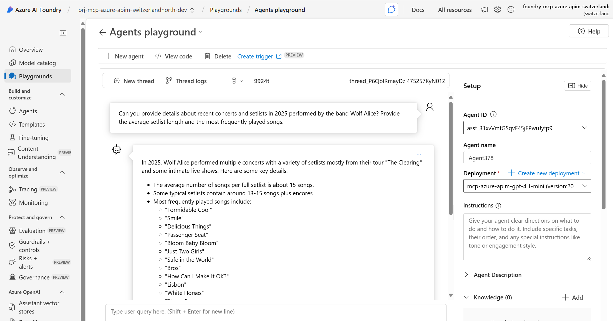

# mcp-azure-apim

This project demonstrates how to use Azure API Management (APIM) to expose an existing REST API as a Model-Context-Protocol (MCP) Server. The MCP Server can then be consumed as a tool by various clients, including AI agents built with Azure AI services.

The project uses the public [Setlist.fm API](https://api.setlist.fm/docs/1.0/index.html) as an example. It provisions the necessary Azure infrastructure using Bicep and the Azure Developer CLI (`azd`).

The `src` directory contains two Python examples of how to consume the MCP Server:

1.  A simple command-line client (`mcp_client.py`) that lists the available tools and executes them.
2.  An AI agent (`azure_ai_agent_mcp.py`) that uses the MCP Server as a tool to answer natural language questions about musical artists and their setlists.

## Documentation

- https://learn.microsoft.com/en-us/azure/api-management/mcp-server-overview
- https://devblogs.microsoft.com/foundry/announcing-model-context-protocol-support-preview-in-azure-ai-foundry-agent-service/

## Configuration

### Configure Azure Resources

This project is using `azd` to configure the Azure Resources

```bash
azd auth login
azd provision
```

This project is configured using Azure Bicep, which defines the following resources:

1. **API Management**

   - **Name**: `${rootname}-api-management-${environmentName}`
   - **Publisher Name**: Setlistfy Apps
   - **SKU**: Basicv2
   - **Description**: Manages APIs for the application, providing a gateway for API calls.

2. **Application Insights**

   - **Name**: `${rootname}-app-insights`
   - **Description**: Monitors application performance and usage, providing insights into the application's health.

3. **Log Analytics Workspace**

   - **Name**: `${rootname}-log-analytics`
   - **Description**: Collects and analyzes log data from various resources for monitoring and troubleshooting.

4. **Event Hub**

   - **Namespace Name**: `${rootname}-ehn-${uniqueString(resourceGroup().id)}`
   - **Description**: A scalable event ingestion service for processing large amounts of data in real-time.

5. **AI Foundry**

   - **Name**: `foundry-${rootname}-${aiFoundryLocation}-${environmentName}`
   - **Description**: Deploys AI models, specifically a GPT-4.1 mini model for inference.

6. **SetlistFM API**

   - **Name**: `setlistfm`
   - **Description**: Provides access to the SetlistFM API, allowing users to retrieve setlist data.
   - **Service URL**: `https://api.setlist.fm/rest`

7. **Named Value for API Key**
   - **Name**: `setlisfm-api-key`
   - **Description**: Stores the API key securely for accessing the SetlistFM API.

### Configure MCP Server

Go the Azure Portal https://portal.azure.com, select the APIM instance and MCP Servers (preview)
Create a MCP Server, expose API as an MCP Server

- API: `SetList FM`
- API Operations: `Search for Artists, Search for Setlists`
- Display Name: `MCP Setlist FM`
- Name: `mcp-setlist-fm`

The MCP Server is ready.


### Test API using Shell

```bash
cd src/shell
azd env get-values > .env
./test_api.sh
```

Open mcp.json file
Start the toosl
open a new githup copilot session
promtp:'using the setlistfm tools, give me the setlists of Coldplay'

### Test MCP Server (Python)

Prepare the environment:

```bash
cd src/python
uv venv
source .venv/bin/activate
azd env get-values > .env
uv sync
```

#### Using MCP Client

`mcp_client.py` uses a library acting as MCP Client. It lists the exposed tools, and call them: `searchForArtists(coldplay)` and `searchForSetlists(Blondshell)`

```bash
uv run mcp_client.py
```

Sample Output

```
🔗 Testing connection to https://mcp-azure-apim-api-management-dev.azure-api.net/setlistfm-mcp/mcp...
✅ Successfully authenticated!
🔧 Available tools (2):
   - searchForArtists
     Input Schema: {'type': 'object', 'properties': {'artistName': {'type': 'string', 'description': "the artist's name"}, 'p': {'type': 'string', 'description': "the number of the result page you'd like to have"}}, 'required': ['artistName', 'p'], 'additionalProperties': False}
   - searchForSetlists
     Input Schema: {'type': 'object', 'properties': {'year': {'type': 'string', 'description': 'the year of the event'}, 'artistName': {'type': 'string', 'description': "the artist's name"}, 'p': {'type': 'string', 'description': 'the number of the result page'}, 'artistMbid': {'type': 'string', 'description': "the artist's Musicbrainz Identifier (mbid)"}}, 'required': ['artistMbid', 'artistName', 'p', 'year'], 'additionalProperties': False}
🔗 Search for artists with 'Coldplay' in the name
{
   "type" : "artists",
   "itemsPerPage" : 30,
   "page" : 1,
   "total" : 60,
   "artist" : [ {
      "mbid" : "233c19bd-082f-48e5-8863-59c58dac698d",
      "name" : "Buena Vista Social Club vs. Coldplay",
      "sortName" : "Buena Vista Social Club vs. Coldplay",
      "disambiguation" : "",
      "url" : "https://www.setlist.fm/setlists/buena-vista-social-club-vs-coldplay-5bd5f7a4.html"
   }, {
      "mbid" : "0ebca0b1-e712-430b-aa73-d3ebd295fcd5",
      "name" : "Michael Calfan & Coldplay",
      "sortName" : "Calfan, Michael & Coldplay",
      "disambiguation" : "",
      "url" : "https://www.setlist.fm/setlists/michael-calfan-and-coldplay-6bdf329e.html"
   }, {
    ....
```

#### Using Agent

`azure_ai_agent_mcp.py` uses the [Azure Agent Service] library to create an [Agent in Azure AI Foundry] configured to use the `SetlistFM MCP Server` as tool.

```bash
uv run azure_ai_agent_mcp.py
```

Sample Output:

```
Setting up Setlist FM plugin https://mcp-azure-apim-api-management-dev.azure-api.net/setlistfm-mcp/mcp
MCP Tool configured with HEADERs: {'Ocp-Apim-Subscription-Key': 'b5a0cd59c5d84ea7bf80611ddc6ebd71'}
MCP Tool resources: {'mcp': [{'server_label': 'setlisftfm', 'headers': {'Ocp-Apim-Subscription-Key': 'b5a0cd59c5d84ea7bf80611ddc6ebd71'}, 'require_approval': 'always'}]}
Created agent, ID: asst_N5OIDYE56NQp6JrIEFKuQHPN
MCP Server: setlisftfm at https://mcp-azure-apim-api-management-dev.azure-api.net/setlistfm-mcp/mcp
Created thread, ID: thread_P6QbIRmayDzl475257KyN01Z
Posting task to agent: Can you provide details about recent concerts and setlists in 2025 performed by the band Wolf Alice? Provide the average setlist length and the most frequently played songs.
Created message, ID: msg_EGr8udkkxcXEohofJkA4wzb7
Created run, ID: run_3Di0dhGGNyzCVq4uafqXYm1k
Current run status: RunStatus.IN_PROGRESS
Approving tool call: mcp/setlisftfm/searchForArtists
 with inputs: {"artistName":"Wolf Alice","p":"1"}
Current run status: RunStatus.REQUIRES_ACTION
Current run status: RunStatus.IN_PROGRESS
Current run status: RunStatus.IN_PROGRESS
Current run status: RunStatus.IN_PROGRESS
Current run status: RunStatus.IN_PROGRESS
Approving tool call: mcp/setlisftfm/searchForSetlists
 with inputs: {"year":"2025","artistName":"Wolf Alice","p":"1","artistMbid":"3547f34a-db02-4ab7-b4a0-380e1ef951a9"}
Current run status: RunStatus.REQUIRES_ACTION
Current run status: RunStatus.IN_PROGRESS
Current run status: RunStatus.IN_PROGRESS
Current run status: RunStatus.IN_PROGRESS
Current run status: RunStatus.IN_PROGRESS
Current run status: RunStatus.IN_PROGRESS
Current run status: RunStatus.IN_PROGRESS
Current run status: RunStatus.IN_PROGRESS
Current run status: RunStatus.IN_PROGRESS
Current run status: RunStatus.IN_PROGRESS
Current run status: RunStatus.IN_PROGRESS
Current run status: RunStatus.IN_PROGRESS
Current run status: RunStatus.COMPLETED
Run completed with status: RunStatus.COMPLETED
Step step_NmSFDvYVsCfLmWQf7g7sxyvO status: completed

Step step_16Z5uF6mtBH6EmP7rAGP9j6M status: completed
 Tool Call ID: call_HnHm4qXiLXbFzvGxoGwgvkyF
 Type: mcp/setlisftfm/searchForSetlists
 inputs: {"year":"2025","artistName":"Wolf Alice","p":"1","artistMbid":"3547f34a-db02-4ab7-b4a0-380e1ef951a9"}

Step step_KYw0M9Jm5j7xKyKwonyN3xpO status: completed
 Tool Call ID: call_kJYPeExQqL5jBzm78BYBzV86
 Type: mcp/setlisftfm/searchForArtists
 inputs: {"artistName":"Wolf Alice","p":"1"}


Conversation:
--------------------------------------------------
USER: Can you provide details about recent concerts and setlists in 2025 performed by the band Wolf Alice? Provide the average setlist length and the most frequently played songs.
--------------------------------------------------
ASSISTANT: In 2025, Wolf Alice performed multiple concerts with a variety of setlists mostly from their tour "The Clearing" and some intimate live shows. Here are some key details:

- The average number of songs per full setlist is about 15 songs.
- Some typical setlists contain around 13-15 songs plus encores.
- Most frequently played songs include:
  - "Formidable Cool"
  - "Smile"
  - "Delicious Things"
  - "Passenger Seat"
  - "Bloom Baby Bloom"
  - "Just Two Girls"
  - "Safe in the World"
  - "Bros"
  - "How Can I Make It OK?"
  - "Lisbon"
  - "White Horses"
  - "Thorns"
  - "Don't Delete the Kisses"
  - "The Sofa"
  - "Giant Peach"

- They often close encore segments with "The Sofa" and "Giant Peach," sometimes featuring the outro of "Seven Nation Army" and "Iron Man."

The overall concert length in terms of setlist size is consistent around the range of 13 to 16 songs, including encores.

You can view detailed setlists for each show on their setlist.fm page: https://www.setlist.fm/setlists/wolf-alice-bdcd1c2.html
```

### AI Foundry

once executed, it is possible to view the executed thread in the AI Foundry Portal http://ai.azure.com




## Clean up

```bash
azd down --force --purge
```
